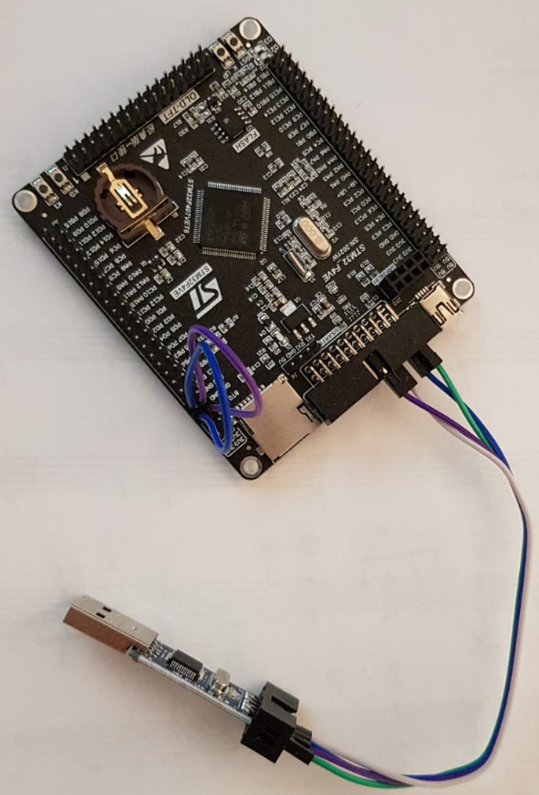

# NextLevelRTOS

 

## Description
This will be a minimal multithreaded realtime operating system for the ARM CortexM4 processor without unnecessary libraries. The final goal is to compile your own OS with only the features you need - no boilerplate code, no libraries which inflate your binary without knowing exactly what they actually do. 
For this system the STM32F407VET6 board is used as developing platform.
One benefit is that the system is written in rust, so feel free to contribute for steps towards the future!

*NEW:* This repository acts also as a tutorial how to build such a system. Each branch is build on top of the other to help to understand the whole process. There is also a documentation sheet for each chapter to give more insights in this work. **BACKLOG**

## Implemented Features
* Multiprocess Round Robin Scheduling up to N Tasks
* Basic User-/Kernelspace separating using Cortex M4 Handler-/Threadmode feature
* Basic UART TX for println function to host
* Basic access to GPIO Device
* Basic malloc for dynamic TCB Linked List

## Upcoming Features
* Execute parts of usercode in real time mode for deterministic results
* Move tasks to blocked queue if necessary and wake up them asap when necessary.
* DriverAPI to make kernel independent from device wrappers, as they are implemented right now
* CPU LowPowerMode, when only init process remains in active task queue
* rtosHealth GUI for monitoring device status and interaction. Will be developed with QT.
* Dynamically feed system with precompiled ELF Files / User Programms
* ...
